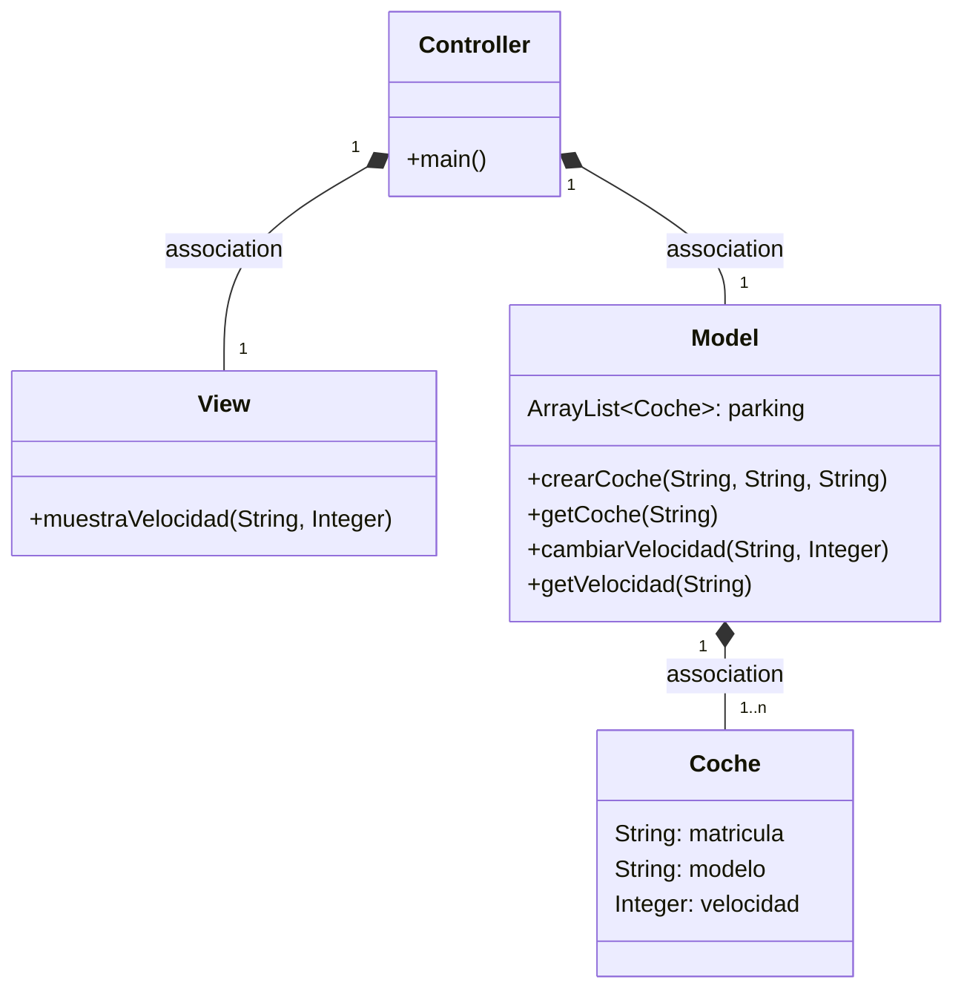
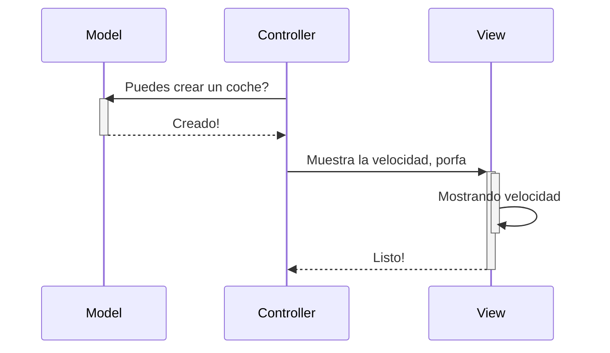
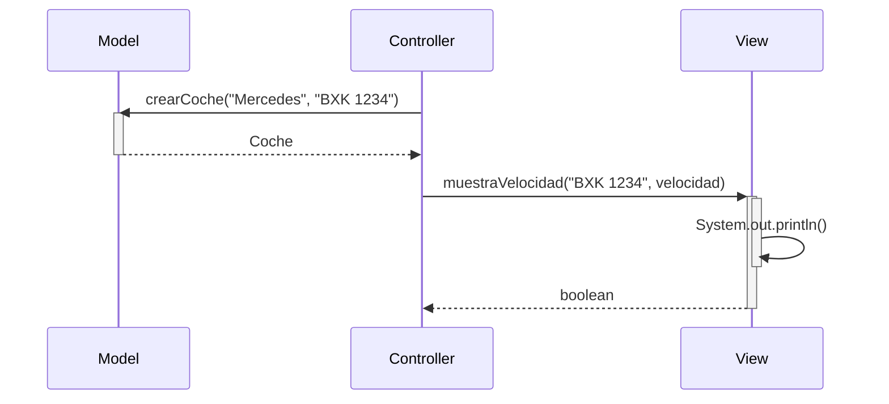

# Arquitectura MVC

Aplicación que trabaja con objetos coches, modifica la velocidad y la muestra

---
## Diagrama de clases:

```mermaid
classDiagram
    class Coche {
        String: matricula
        String: modelo
        Integer: velocidad
    }
      class Controller{
          +main()
      }
      class View {+muestraVelocidad(String, Integer)}
      class Model {
          ArrayList~Coche~: parking
          +crearCoche(String, String, String)
          +getCoche(String)
          +cambiarVelocidad(String, Integer)
          +getVelocidad(String)
      }
    Controller "1" *-- "1" Model : association
    Controller "1" *-- "1" View : association
    Model "1" *-- "1..n" Coche : association
      
```

---

## Diagrama de Secuencia

Ejemplo básico del procedimiento, sin utilizar los nombres de los métodos

```mermaid
sequenceDiagram
    participant Model
    participant Controller
    participant View
    Controller->>Model: Puedes crear un coche?
    activate Model
    Model-->>Controller: Creado!
    deactivate Model
    Controller->>+View: Muestra la velocidad, porfa
    activate View
    View->>-View: Mostrando velocidad
    View-->>Controller: Listo!
    deactivate View
```

El mismo diagrama con los nombres de los métodos

```mermaid
sequenceDiagram
    participant Model
    participant Controller
    participant View
    Controller->>Model: crearCoche("Mercedes", "BXK 1234")
    activate Model
    Model-->>Controller: Coche
    deactivate Model
    Controller->>+View: muestraVelocidad("BXK 1234", velocidad)
    activate View
    View->>-View: System.out.println()
    View-->>Controller: boolean
    deactivate View
```

